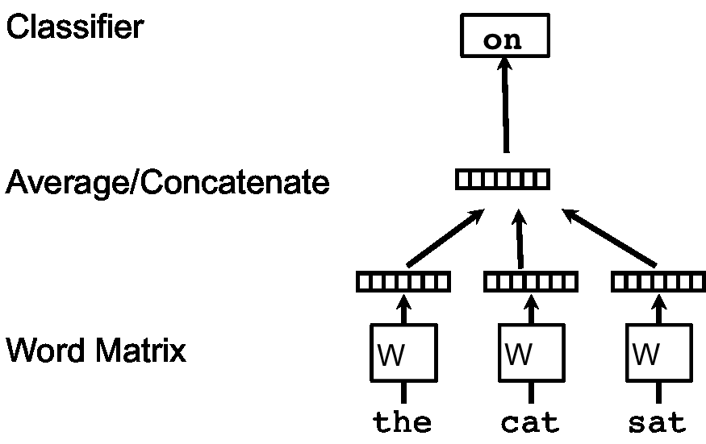
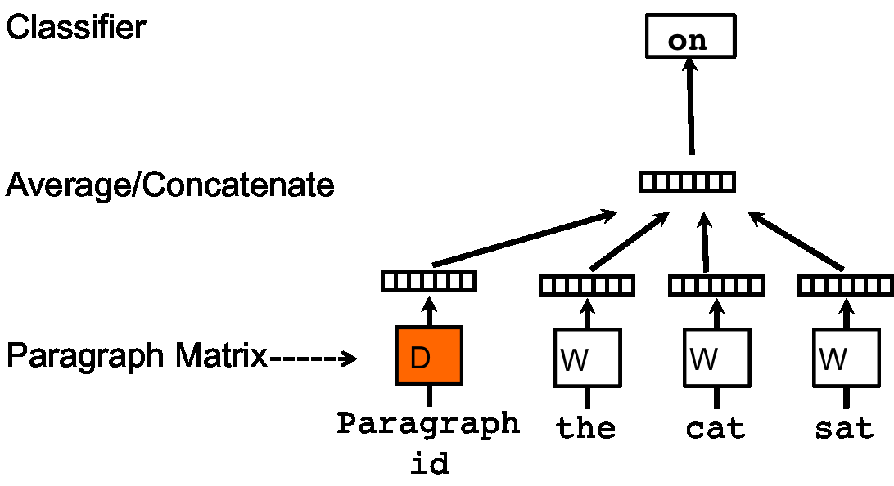
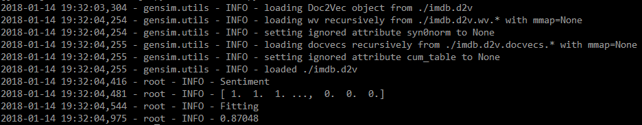

# Doc2Vec模型
---

[TOC]


## 摘要
---

*通过本文，你将了解到：*

*  **Doc2Vec模型是如何产生的**
*  **Doc2Vec模型细节**
*  **Doc2Vec模型的特点**
*  **Doc2Vec的使用及代码(gensim)**

## 背景
---

&emsp;&emsp;Doc2Vec模型的产生要从词向量表示(论文[word2vec模型][1])开始说起，该文章介绍了两种词的向量表示方法CBOW和Skip-gram.
&emsp;&emsp;本小结以CBOW为例回顾模型的一些细节：
&emsp;&emsp;CBOW模型的框架如下图所示：

<div align=center>
 


&emsp;&emsp;词典中的每一个词用一个向量表示，对应矩阵$W$中的一个列向量，而具体对应哪一列则取决于该词在词典中的位置。
&emsp;&emsp;具体地，给定一个用于训练的词序列$w_1,w_2,...,w_T$，词向量模型的目标函数是最大化平均对数似然概率：$$\frac{1}{T}\sum_{t=k}^{T-k}log\ p(w_t|w_{t-k},...,w_{t+k})$$&emsp;&emsp;预测任务可以通过一个多分类器来完成，如softmax分类器：
$$p(w_t|w_{t-k},...,w_{t+k})=\frac{e^{y_{w_t}}}{\sum_{i}e^{y_i}}$$&emsp;&emsp;其中$y_i$表示词$i$归一化之前的输出值。计算表达式为：$$y=b+Uh(w_{t-k},...,w_{t+k};W) \qquad (1)$$
&emsp;&emsp;其中，$U,b$是softmax的参数，$h$通过对词向量进行**取平均**或者**相连接**得到。
&emsp;&emsp;当然，对于该模型，在实现的过程中有很多优化的方法，如**层级softmax**，**负采样**，**subsampling**，具体介绍可以参考笔者博客[Word2Vec][3]或者原作者论文[Efficient Estimation of Word Representations in Vector Space][2]，如果想对Word2Vec进一步了解可以参考[源代码][4]。
&emsp;&emsp;训练出的结果有什么特点呢？对于得到的词向量，具有相近含义的词(如"powerful" 和 "strong")在向量空间中距离较近。一个经典的结论是$v(King)-v(man)+v(woman)=v(Queen)$。

## 段落向量
---
&emsp;&emsp;**段落向量怎么得到呢？**作者灵感来自于词向量的获取过程，虽然我们将词向量随机初始化，但是在我们用这些向量去预测句子中下一个词是什么的过程中，通过不断的调整参数以最小化真实值和预测值的差值，我们最终可以间接的得到这些词的向量表示。
&emsp;&emsp;所以作者就想，是不是可以通过初始化一个段落向量，并使用该段落向量和词向量来对句子中下一个词进行预测从而得到段落向量和词向量呢？本文中要介绍的两个模型**PV-DM**和**PV-DBOW**就是这样产生的。

### PV-DM模型
---
&emsp;&emsp;PV-DM模型框架如下：

<div align=center>
 

&emsp;&emsp;每一个段落表示为一个向量，对应矩阵$D$中的一个列向量，每一个词表示为一个向量，对应矩阵$W$中的一个列向量。段落向量和词向量通过取平均值或者相连接来对上下文(context)中的下一个词进行预测。
&emsp;&emsp;**该模型对词向量模型的唯一一个改变是在词向量模型中的(1)式中，函数$h$通过$W$和$D$共同构造。**
&emsp;&emsp;我们可以将段落向量当做一个词向量(段落向量和词向量的维度可能不同)，训练方法和预测都与词向量模型大同小异。但是需要注意一点是：**不同的段落具有不同段落向量，但是不同段落中的相同词具有相同的词向量**。
&emsp;&emsp;该模型的一个主要的优点是：**段落向量的获得过程中，可以对没有标记的数据进集行训练**，换句话说，在段落向量的获取过程中，无论数据集有没有标记，都可以拿来训练。

### PV-DBOW模型
---
&emsp;&emsp;PV-DBOW模型框架如下：

<div align=center>
 

&emsp;&emsp;该模型原理和PV-DM模型相同，但是该模型是在随机梯度下降的每一次迭代中采样一个文本窗口(text window)，再从该文本窗口中随机采样一个词，从而形成一个给定段落向量进行词预测的多分类任务。该模型和Skip-gram模型相似。

## gensim实现Doc2Vec
---
```
from gensim import utils
from gensim.models.doc2vec import TaggedDocument
from gensim.models import Doc2Vec

import numpy as np

from sklearn.linear_model import LogisticRegression

import logging
import sys
import random

# code from the tutorial of the python model logging.
# create a logger, the same name corresponding to the same logger.
logger = logging.getLogger()
logger.setLevel(logging.INFO)

# create console handler and set level to info
ch = logging.StreamHandler(sys.stdout)
ch.setLevel(logging.INFO)

# create formatter and add formatter to ch
formatter = logging.Formatter('%(asctime)s - %(name)s - %(levelname)s - %(message)s')
ch.setFormatter(formatter)

logger.addHandler(ch)   # add ch to the logger


## the code for the doc2vec
class TaggedLineSentence(object):
    """
    sources: [file1 name: tag1 name, file2 name: tag2 name ...]
    privade two functions:
        to_array: transfer each line to a object of TaggedDocument and then add to a list
        perm: permutations
    """
    def __init__(self, sources):
        self.sources = sources

    def to_array(self):
        self.sentences = []
        for source, prefix in self.sources.items():
            with utils.smart_open(source) as fin:
                for item_no, line in enumerate(fin):
                    # TaggedDocument([word1, word2 ...], [tagx])
                    self.sentences.append(TaggedDocument(utils.to_unicode(line).split(), 
                                       [prefix + '_%s' % item_no]))
        return self.sentences

    def perm(self):
        shuffled = list(self.sentences)
        random.shuffle(shuffled)    # Note that this line does not return anything.
        return shuffled


sources = {'test-neg.txt': 'TEST_NEG', 'test-pos.txt': 'TEST_POS', 
           'train-neg.txt': 'TRAIN_NEG','train-pos.txt': 'TRAIN_POS', 
           'train-unsup.txt': 'TRAIN_UNS'}
sentences = TaggedLineSentence(sources)

# set the parameter and get a model.
# by default dm=1, PV-DM is used. Otherwise, PV-DBOW is employed.
model = Doc2Vec(min_count=1, window=10, size=100, 
                sample=1e-4, negative=5, dm=1, workers=7)
model.build_vocab(sentences.to_array())

# train the model
for epoch in range(20):
    logger.info('epoch %d' % epoch)
    model.train(sentences.perm(),
                total_examples=model.corpus_count,
                epochs=model.iter
                )

logger.info('model saved')
model.save('./imdb.d2v')

# load and test the model
logger.info('model loaded')
model = Doc2Vec.load('./imdb.d2v')

logger.info('Sentiment Analysis...')

logger.info('transfer the train document to the vector')
train_arrays = np.zeros((25000, 100))
train_labels = np.zeros(25000)

for i in range(12500):
    prefix_train_pos = 'TRAIN_POS_' + str(i)
    prefix_train_neg = 'TRAIN_NEG_' + str(i)
    # note that the attribute is model.docvecs
    train_arrays[i], train_arrays[12500+i] = \
        model.docvecs[prefix_train_pos], model.docvecs[prefix_train_neg]
    train_labels[i], train_labels[12500+i] = 1, 0


logger.info('transfer the test document to the vector')
test_arrays = np.zeros((25000, 100))
test_labels = np.zeros(25000)

for i in range(12500):
    prefix_test_pos = 'TEST_POS_' + str(i)
    prefix_test_neg = 'TEST_NEG_' + str(i)
    test_arrays[i], test_arrays[12500 + i] = \
        model.docvecs[prefix_test_pos], model.docvecs[prefix_test_neg]
    test_labels[i], test_labels[12500 + i] = 1, 0

logger.info('Fitting')
classifier = LogisticRegression()
classifier.fit(train_arrays, train_labels)

print("accuracy: "+ str(classifier.score(test_arrays, test_labels)))

```

&emsp;&emsp;使用[IMDB数据集](http://www.cs.cornell.edu/people/pabo/movie-review-data/)，情感分析准确率达到87%，代码以及数据贴到了[github][6]上，实验结果如下：

<div align=center>



## 说明
---
&emsp;&emsp;*本文有不当或错误的地方欢迎指正。*


## 参考文献
---

1. word2vec模型：[Distributed Representations of Words and Phrases and their Compositionality][1]
2. word2vec模型优化：[Efficient Estimation of Word Representations in Vector Space][2]
3. Doc2Vec模型：[Distributed Representations of Sentences and Documents][5]
3. CSDN博客：[基于gensim的Doc2Vec实现](http://blog.csdn.net/lenbow/article/details/52120230)
4. [Sentiment Analysis Using Doc2Vec](http://linanqiu.github.io/2015/10/07/word2vec-sentiment/)

[1]: http://papers.nips.cc/paper/5021-distributed-representations-of-words-and-phrases-and-their-compositionality.pdf
[2]: https://arxiv.org/pdf/1301.3781.pdf
[3]: http://blog.csdn.net/walker_hao/article/details/78958039
[4]: https://code.google.com/archive/p/word2vec
[5]: http://proceedings.mlr.press/v32/le14.pdf
[6]: https://github.com/walkeao/NLP/blob/master/long%20text%20to%20vector/doc2vec/


